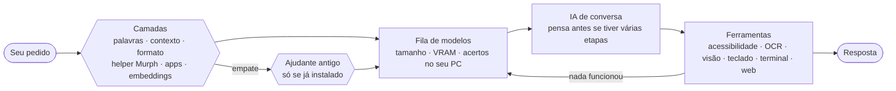

<div align="center">


# openTARS

**O assistente de IA local pro Linux que escolhe a IA certa pra cada pedido.**

Você pede do seu jeito. Ele abre programas, clica nos botões pelo nome, digita, pesquisa, olha a tela e roda comandos.<br>
Tudo na sua máquina, via Ollama: sem nuvem, sem conta, sem mensalidade.

[](#instalação)
[](LICENSE)
[](#compatibilidade)
[](https://ollama.com)
[](#idiomas)
[](https://www.instagram.com/open.tars/)

[Instalar](#instalação) · [Como funciona](#como-funciona) · [Usar](#uso) · [Idiomas](#idiomas) · [Problemas comuns](#problemas-comuns) · [Instagram](https://www.instagram.com/open.tars/)

<br>


<sub>As imagens mostram a janela e a calculadora de verdade; nelas, as respostas do modelo foram roteirizadas pra demonstração.</sub><br>
<sub>🇺🇸 <i>English:</i> openTARS is a 100% local AI assistant for Linux. The interface speaks English, Spanish, French and German too — pick it in the language menu.</sub>

</div>

<br>

## Por que o openTARS

<table>
<tr>
<td width="33%" valign="top">

### Escolhe a IA sozinho
Várias camadas leem cada pedido em milissegundos, sem gastar IA nenhuma, e mandam pro modelo mais adequado entre os que você já tem: o que enxerga a tela, o de programação, o geral ou o mais rápido. E só liga o "raciocínio" quando ele ajuda: abrir e fechar programas sai na hora.

</td>
<td width="33%" valign="top">

### Clica pelo nome, não pela posição
Ele aperta os botões pelo texto que aparece neles ("7", "=", "Salvar"), pela acessibilidade do Linux: sem print, sem coordenada, em milissegundos, até no Wayland. O print continua como plano B.

</td>
<td width="33%" valign="top">

### Fica no seu PC
Nada do que você digita ou mostra sai da sua máquina. Comandos perigosos pedem confirmação, e ele nunca fecha um programa com trabalho não salvo.

</td>
</tr>
</table>

## Instalação

Pra Ubuntu, Debian, Linux Mint, Zorin OS, Pop!_OS e derivados. Cole no terminal:

```bash
wget -O /tmp/opentars.deb https://github.com/enzorcasao-ctrl/openTars-lightweight-local-addon/raw/main/opentars_all.deb && sudo apt install -y --reinstall /tmp/opentars.deb
```

Pronto: esse comando instala **tudo** que o openTARS precisa, pulando o que você já tiver:

- todas as dependências do sistema, pelo apt (inclusive a de acessibilidade, pro clique pelo nome)
- o Ollama (ou usa o que já estiver rodando, inclusive em Docker)
- um ambiente Python isolado
- o modelo de embeddings `granite-embedding:278m` (~560 MB), que entende o pedido em milissegundos
- o leitor de texto da tela (OCR `tesseract`), pra clicar em apps que não mostram os botões pra acessibilidade
- **um modelo de conversa escolhido pelo seu hardware**, se você ainda não tiver nenhum: `qwen3:8b` com placa de vídeo de 6 GB ou mais, `qwen3:4b` com 12 GB de RAM ou mais, e `qwen3:1.7b` nos demais
- o atalho no menu de aplicativos

Nenhum modelo ajudante é baixado: quem decide o tipo de cada pedido é a **helper Murph 1.0**, que já vem no pacote (3.0.5). O antigo `qwen2.5:0.5b` saiu do download; se você já tiver ele, só desempata enquanto acertar mais que a Murph no `--avaliar-classificador`. A **voz** também é opcional: instale pelo botão **Voz** da janela ou com `opentars --instalar-voz`.

O instalador fala o idioma do seu sistema. Pra **atualizar**, rode o mesmo comando: o histórico de conversas e as suas escolhas são mantidos.

Depois de instalar, rode uma vez `opentars --autoteste`: ele confere o ambiente e faz um teste de verdade (a IA abre a calculadora e faz 7 + 2), e salva um relatório em `~/opentars-autoteste.txt`.

<details>
<summary>Quer mais modelos?</summary>

Quanto mais modelos diferentes você tiver, mais o openTARS consegue adaptar a IA ao pedido. Pra ele **ver a tela** (descrever imagens, apps sem acessibilidade), baixe um modelo com visão e ferramentas:

```bash
ollama pull qwen3-vl:8b
```

Pra escolher outro modelo de conversa na instalação, coloque `TARS_MODELO_CONVERSA=qwen3:14b` antes do `apt install` (ex: `sudo TARS_MODELO_CONVERSA=qwen3:14b apt install -y --reinstall /tmp/opentars.deb`). Pra não baixar nenhum: `TARS_SEM_MODELO=1`.

</details>

<details>
<summary>Prefere baixar o arquivo manualmente?</summary>

Clique em [`opentars_all.deb`](https://github.com/enzorcasao-ctrl/openTars-lightweight-local-addon/raw/main/opentars_all.deb) e, na pasta onde ele foi salvo (normalmente `~/Downloads`):

```bash
sudo apt install -y --reinstall ./opentars_all.deb
```

</details>

## Como funciona



### 1. Várias camadas decidem o tipo do pedido

Cada camada olha o pedido de um jeito e dá votos. Quando uma delas é clara, as outras nem precisam rodar:

| Camada | O que olha | Exemplo |
|---|---|---|
| **Palavras-chave** | verbo ou alvo explícito | "**feche** o Firefox" → ação, na hora |
| **Contexto** | continuação do pedido anterior | "agora clica no =" depois de abrir a calculadora → ação |
| **Formato** | código colado, erro, comando, link, pergunta, cumprimento | um `Traceback` → código; `E: dpkg...` → Linux/sistema |
| **helper Murph 1.0** | a ajudante local, que já vem no pacote (aparece na barra de status da janela e no `opentars --version`): um modelo pequeno treinado com ~2.900 frases nos 5 idiomas (os exemplos do openTARS mais frases novas escritas por um modelo grande, a receita do TinyStories). Roda em ~0,2 ms, sem Ollama. Num teste cego, com pedidos bagunçados que ela nunca viu, acertou 93% sozinha (o classificador antigo: 84%); quando diz que está segura, acerta 99%. Pedido estranho (letras aleatórias, outra língua) fica em dúvida e passa pras camadas seguintes | "abaixa um pouquinho o som" → ação |
| **Apps** | cita um app instalado | "o spotify tá mudo" → ação |
| **Embeddings** | o *sentido*, comparado com frases de exemplo, em qualquer idioma (~20 ms) | "minha tela ficou preta depois do update" → Linux/sistema |
| **Ajudante antigo** | não é mais baixado (3.0.5). Se o `qwen2.5:0.5b` já estiver instalado, só entra se as camadas empatarem, escolhendo entre as 2–3 finalistas; se ele acertar menos que a Murph no `--avaliar-classificador`, deixa de ser consultado | "quero umas receitas de lasanha pra assistir" → busca |
| **Coerência** | corrige resultado sem sentido | "conversa simples" num pedido de 20 palavras → geral |

A camada também percebe **pedidos com várias etapas** ("abre o Claude **e** faz uma pergunta"). Nesses, a IA pensa antes de agir, recebe um lembrete de fazer tudo e o pedido vai pro maior modelo que roda bem no seu PC.

Pra ver o raciocínio de um pedido, camada por camada, e a fila de modelos:

```bash
opentars --explicar "abre o claude e faz uma pergunta simples"
```

### 2. A fila de modelos aprende com o seu PC

O openTARS escolhe entre os modelos que você tem, pelo tamanho e pelo que cabe na VRAM. Especialistas em programação (`qwen2.5-coder` e parecidos) **só** atendem código. E ele anota, por tarefa, se cada modelo deu certo ou falhou nas últimas vezes: quem falha a maioria das vezes numa tarefa desce na fila **daquela** tarefa, e volta a subir se passar a acertar.

### 3. A IA trabalha com rede de segurança

- **Chamadas malfeitas são consertadas:** `open_app` vira `open_application`, `app_name` vira `app`, `"120"` vira `120`.
- **"Pronto!" sem ter feito nada é cobrado:** se a IA diz que abriu, clicou ou enviou sem ter chamado a ferramenta, ou logo depois de uma que falhou, ela é mandada fazer de verdade (ou contar o que deu errado).
- **Ela sabe o que está aberto:** num pedido de ação, recebe a lista de janelas abertas e qual tem o foco.
- **Não anda em círculos:**
  - repetir exatamente o que já falhou nem roda de novo;
  - 3 falhas da mesma ferramenta: ela é mandada mudar de estratégia;
  - 8 falhas seguidas: o próximo modelo da fila assume a mesma conversa, vendo o que já falhou.
- **Modelo que quebra ou recusa passa o pedido adiante:** sem memória, erro do Ollama ou "não consigo" insistente mandam o pedido pro próximo modelo da fila.
- **Ferramentas por tarefa:** uma busca recebe só as ferramentas de busca, e modelo pequeno erra bem menos com menos opções. Se precisar, ela ganha todas.

### 4. Apps sem acessibilidade também funcionam

O clique pelo nome tenta, nesta ordem:

1. **Acessibilidade:** aperta o botão pelo nome, sem mouse e sem print (apps GTK, Qt, Firefox, LibreOffice…).
2. **Texto na tela (OCR):** apps que não expõem os botões (Claude, Discord, VS Code, jogos, apps Java) têm a janela lida pelo `tesseract`, e o clique vai onde o texto está escrito. O `list_elements` devolve os textos que a janela mostra, e o `type_in_element` acha o campo pelo texto dele ("Pergunte algo…"), clica, digita e envia.
3. **Visão, em grade:** ícone sem texto ("ícone de enviar")? Um modelo com visão, se você tiver um, aponta o lugar numa grade (A1, B2…) em rodadas de zoom (mais rodadas enquanto a célula ainda for grande, até achar um X de aba de 14 px), e o openTARS mira no centro do ícone. Funciona com qualquer modelo com visão, porque ele só precisa dizer a célula, não coordenadas.
4. **Teclado:** sem nada disso, a IA escreve no campo que tem o foco.

### Mouse preciso

- **Arrastar de verdade:** `drag_mouse` segura o botão, sai devagar do lugar (o Chrome/Brave só entende que é arrasto depois de uns pixels) e solta no destino: um lugar da tela ("top-left", "direita", "centro", "metade esquerda"), outro elemento ("Lixeira") ou um ponto. A origem pode ser descrita ("aba do YouTube"): o openTARS acha sozinho.
- **Mira com zoom:** o `click_mouse` recebe o que se quer clicar (`target="X da aba do YouTube"`). A coordenada que a IA chuta costuma errar por 10–40 px; o openTARS dá zoom em volta dela e acha o alvo exato com a visão em grade. Sem modelo de visão, um clique que caiu do lado de um botão encaixa nele.
- **Move janela de verdade:** "arraste a janela do openTARS pro topo esquerdo", "põe o Firefox na metade direita", "maximiza o terminal": o openTARS pede ao gerenciador de janelas (`move_window`), em vez de arrastar o que está escrito dentro dela.
- **Confere o clique:** compara a tela antes e depois. Se nada mudou, a IA recebe "o clique ERROU" em vez de dizer que fez.

Apps Electron (Claude, Discord, VS Code…) abertos **pelo openTARS** já saem com a acessibilidade ligada. Aí o clique pelo nome funciona neles direto.

### 5. Planeja e confere (3.0)

Pedido com várias etapas ("abre o gmail e depois o spotify") vira um **plano** numerado, que aparece na tela e vai pra IA. Se ela tentar encerrar antes de fazer todas as etapas, recebe o plano de volta com o que falta. Clique que não mudou nada na tela seguido de "Pronto!" é cobrado, e cliques no nada em sequência contam como andar em círculos: outro modelo assume ou a IA explica o que travou.

### 6. Voz, rotinas e memória (3.0)

- **Voz, 100% local:** diga **"TARS, abre o Firefox"**. Um Whisper pequenininho fica ouvindo só o nome; o pedido é transcrito por um maior (faster-whisper, na CPU), e a resposta sai falada pelo Piper. `Ctrl+M` (ou **Voz ▾ → Falar agora**) fala sem precisar dizer "TARS". Liga no botão **Voz** da janela, ou com `opentars --voz` pra usar só a voz, sem janela.
  - **Responde rápido (3.0 Miller):** os modelos já ficam carregados; o nome é conferido enquanto você ainda fala (a tela mostra na hora que ouviu); no fim da frase só falta entender o pedido. "TARS" sozinho: ele responde **"Sim?"** e espera o pedido. Depois de responder falando, dá pra continuar a conversa **sem dizer "TARS"** por alguns segundos.
- **Rotinas:** "todo dia às 8h abre o gmail e o spotify", "dias úteis às 18h fecha o discord", "daqui a 10 minutos me lembra de tirar o bolo". Na hora, o pedido entra sozinho (com notificação do sistema), enquanto o openTARS estiver aberto (janela, barra rápida ou `opentars --voz`). Ficam em `~/.config/opentars/rotinas.json`.
- **Memória:** "lembra que meu navegador é o Brave", "minha pasta de projetos é ~/dev". Vale pra toda conversa daqui pra frente; "esquece o do Brave" apaga. Fica em `~/.config/opentars/memoria.json`.

### 7. Outros servidores e Wayland (3.0)

- **vLLM, LM Studio, llama.cpp, LocalAI...:** `opentars --servidor http://localhost:1234/v1` e os modelos desse servidor aparecem na escolha de IA como `api:<nome>`, com ferramentas, streaming e tudo. Junto com os do Ollama. `opentars --servidor off` desliga.
- **Wayland de verdade (experimental):** com o `ydotool` 1.0+ e o serviço `ydotoold` rodando, mouse e teclado alcançam qualquer janela, não só as XWayland. Deixe a aceleração do mouse desligada pra mais precisão.

### 8. Uma conversa só

Todos os modelos compartilham a mesma conversa: trocar de IA no meio não faz ela esquecer o que você pediu antes.

## Uso

Abra o **openTARS** no menu de aplicativos, ou rode `opentars-gui`. Pra usar só a voz: `opentars --voz`. O `opentars` sozinho, no terminal, confere se está tudo certo com o ambiente.


A tela inicial traz quatro sugestões pra clicar (no idioma escolhido), uma de cada coisa que ele faz:

| Sugestão | O que mostra |
|---|---|
| Abra a calculadora e faça 12 × 8 pelos botões | clica nos botões pelo nome |
| Quais janelas estão abertas agora? | enxerga o que está aberto |
| Procure vídeos de receita de lasanha no YouTube | pesquisa na web |
| Quanto de memória e disco estou usando? | lê o estado do PC |

Outros exemplos: `feche o spotify e abra o discord`, `o que tem na minha tela?`, `como vejo meu IP no linux?`.

### Código com botão de copiar

Peça um script, uma função ou um comando e o código vem numa janelinha própria, com a linguagem no topo e o botão **Copiar** (copia só o código), como no Claude e no ChatGPT. Pedido de código vai pro seu modelo especialista em programação, se você tiver um (`qwen2.5-coder`, `codestral`, `deepseek-coder`...).


### Barra rápida: `Ctrl+Alt+Espaço`

Aperte `Ctrl+Alt+Espaço` de qualquer lugar e peça sem trocar de janela. A resposta aparece na própria barra; `Esc` fecha, `Ctrl+Enter` abre a janela completa.


O atalho é cadastrado sozinho na primeira vez que você abre o openTARS (GNOME, Zorin, Ubuntu, Cinnamon, MATE e XFCE), sem pisar nos atalhos que você já usa. Aparece em Configurações > Teclado > Atalhos, e dá pra mudar por lá ou assim:

```bash
opentars --atalho ctrl+alt+o     # outra combinação
opentars --atalho off            # remove
```

No KDE e em outros ambientes, cadastre à mão um atalho com o comando `opentars-gui --rapido`.

### Controles

| Na janela | Ou digite | O que faz |
|---|---|---|
| **Parar** ou `Esc` | | interrompe a resposta ou a tarefa na hora |
| `↑` / `↓` | | repete pedidos anteriores |
| seletor **IA** no topo | `/modelo <nome>` · `/modelo auto` | fixa um modelo ou volta pro automático |
| menu **PT-BR ▾** no topo | `/idioma <código>` | troca o idioma |
| **Nova conversa** | `/limpar` | começa do zero (a conversa fica salva entre usos) |
| **Voz ▾** · `Ctrl+M` | | fala o pedido; liga "Ouvir TARS" e "Responder falando" |

Outros comandos:

| Comando | O que faz |
|---|---|
| `opentars --diagnostico` | confere Ollama, modelos, GPU, tela, janelas, acessibilidade e atalho (não mexe em nada) |
| `opentars --autoteste` | diagnóstico + precisão da escolha da tarefa + o teste real com a calculadora |
| `opentars --avaliar-classificador` | mede o quanto cada camada (e o modo AUTO) acerta no seu PC |
| `opentars --explicar "pedido"` | mostra, camada por camada, como a tarefa e o modelo são escolhidos |
| `opentars --instalar-voz` | instala a voz (Whisper + Piper, ~700 MB, tudo local, na sua pasta) |
| `opentars --servidor <url>` | usa também um servidor vLLM / LM Studio / llama.cpp (`off` desliga) |
| `opentars --setup` | instala o que estiver faltando (Ollama, modelos...) |
| `opentars --help` | todos os comandos |

## Idiomas

A janela, a linha de comando, o instalador e o menu de aplicativos falam **português, inglês, espanhol, francês e alemão**. Troque no menu do topo da janela (ou com `/idioma en` / `opentars --idioma es`); a escolha fica salva. Sem escolha, vale o idioma do sistema.

A IA responde no idioma escolhido, e entende pedidos em qualquer um deles: as palavras-chave consideram o idioma escolhido, o do sistema e o inglês.

**Quer o openTARS no seu idioma?** Todos os textos ficam em `idiomas/<código>.json`. Copie o `en.json`, traduza os valores e salve como, por exemplo, `it.json`: o idioma novo aparece no menu sozinho, sem mexer no código. Mande um pull request!

## Compatibilidade

| | Funciona | Observação |
|---|---|---|
| **Distros** | Ubuntu 22.04+, Debian 12+, Mint, Zorin, Pop!_OS e derivados | precisa do `apt` |
| **Desktop** | GNOME, KDE, Cinnamon, XFCE, MATE e outros | apps do menu, Snap e Flatpak, pelo nome em qualquer idioma |
| **Sessão Xorg (X11)** | tudo | |
| **Sessão Wayland** | conversa, abrir apps e sites, comandos, prints e **clique pelo nome** | clique e digitação por coordenada só chegam a alguns apps (limitação do Wayland) |
| **Clique pelo nome** | apps GTK (GNOME), Qt/KDE, Firefox, LibreOffice e, lendo a tela, qualquer app que mostre o texto (Electron, jogos, Java) | ícone sem texto: precisa de um modelo com visão (ex: `qwen3-vl:8b`); o clique lendo a tela precisa de sessão X11 |
| **GPU** | NVIDIA, AMD ou só CPU | sem GPU, o modo automático evita modelos grandes demais |
| **Ollama** | local, Docker ou outra máquina | outro endereço: variável `OLLAMA_HOST` |

## Segurança e privacidade

- Tudo roda localmente. O openTARS não manda dados pra nenhum servidor.
- Comandos que apagam dados ou mexem no sistema (`rm -r`, `mkfs`, `dd`, `git reset --hard`, desligar o PC...) só rodam depois da sua confirmação.
- Comandos que pedem senha (`sudo`) não travam: falham na hora, e a IA mostra o comando pra você rodar.
- Fechar um programa é como clicar no X: se ele perguntar "salvar alterações?", o openTARS não força.
- Pro clique pelo nome, o openTARS liga a acessibilidade da sessão (a mesma que um leitor de tela usa) só quando precisa, e ela volta ao normal ao sair da sessão.
- A leitura da tela (OCR) e a visão rodam no seu PC, como todo o resto.
- O histórico de acertos dos modelos fica em `~/.cache/opentars/historico_modelos.json` (apague pra zerar).
- Tudo que ele executa fica registrado em `~/.tars_log/tars.log`.

<details>
<summary><b>Configuração avançada</b> (variáveis de ambiente)</summary>

| Variável | Pra quê | Padrão |
|---|---|---|
| `OLLAMA_HOST` | endereço do Ollama | `127.0.0.1:11434` |
| `TARS_MODELO_AJUDANTE` | nome do ajudante antigo, se você tiver um instalado (não é baixado desde a 3.0.5) | `qwen2.5:0.5b` |
| `TARS_SERVIDOR_API` / `TARS_CHAVE_API` | servidor compatível com a OpenAI e a chave dele | o de `opentars --servidor` |
| `TARS_WHISPER` / `TARS_WHISPER_ATIVACAO` | modelos do Whisper pro pedido e pro "TARS" | `base` / `tiny` |
| `TARS_YDOTOOL=0` | não usa o ydotool no Wayland | ligado se disponível |
| `TARS_MURPH=off` | usa o classificador antigo (Naive Bayes) no lugar da Murph, pra comparar | Murph ligada |
| `TARS_MODELO_EMBEDDING` | trocar o modelo de embeddings (`off` desliga) | `granite-embedding:278m`, ou outro instalado |
| `TARS_PENSAR` | `sempre` ou `nunca` força o raciocínio da IA | automático, por tipo de pedido |
| `TARS_IDIOMA` | idioma só desta vez, sem salvar | o escolhido no menu |
| `TARS_CONTEXTO` | memória da IA, em tokens | 16384 com GPU de 16 GB+, senão 8192 |
| `TARS_LARGURA_SCREENSHOT` | largura máxima do print enviado à IA | 1280 |
| `TARS_SEM_ACESSIBILIDADE=1` | desliga o clique pelo nome | ligado |
| `TARS_CLIQUE_POR_VISAO=0` | não usa o modelo com visão pra achar ícones sem texto | ligado |
| `TARS_CONTEXTO_JANELAS=0` | não conta pra IA quais janelas estão abertas | ligado |
| `TARS_OCIOSO_MIN` | minutos que a barra rápida fica pronta em segundo plano | 30 |
| `TARS_SEM_CONFIRMACAO_PERIGOSOS=1` | não pedir confirmação de comandos perigosos (por sua conta e risco) | desligado |

Exemplo: `TARS_CONTEXTO=32768 opentars-gui`

</details>

## Problemas comuns

<details>
<summary><b>A IA diz que "não consegue" abrir ou fechar um programa</b></summary>

O openTARS lembra ela das ferramentas e, se ela recusar de novo, passa o pedido pro próximo modelo. Modelos só de programação, como o `qwen2.5-coder`, nunca são escolhidos pra controlar o desktop no modo automático. Se você fixou um deles no seletor **IA**, volte pro **Automático**. Pra isso funcionar, tenha pelo menos um modelo geral (ex: `qwen3:8b`).
</details>

<details>
<summary><b>O clique pelo nome não acha os botões de um app</b></summary>

Quando o app não mostra os botões pra acessibilidade, o openTARS lê o texto da tela. Se nem isso achar, confira:

- **É um ícone sem texto?** Tenha um modelo com visão (`ollama pull qwen3-vl:8b`, ou `gemma3:4b` com pouca VRAM) e peça descrevendo o ícone ("clica no ícone de enviar").
- **É um app Electron** (Claude, Discord, VS Code…) que já estava aberto? Feche e peça pro openTARS abrir: aberto por ele, o app sai com a acessibilidade ligada.
- **Sessão Wayland?** O clique lendo a tela precisa de X11. Na tela de login, escolha "Ubuntu on Xorg" (ou equivalente).
- Rode `opentars --diagnostico` e veja as linhas "Clique pelo nome" e "OCR". Apps Qt/KDE passam a aparecer depois da primeira vez que o openTARS usa a acessibilidade (reabra o app).
</details>

<details>
<summary><b>"Multimodal data provided, but model does not support multimodal requests"</b></summary>

Resolvido na 2.5.2. Quando o modelo da conversa não enxerga imagens (qwen3, llama…), o print não é mais mandado pra ele: um modelo com visão instalado (`gemma3`, `qwen2.5vl`, `llava`…) descreve a tela em texto. Se você não tiver nenhum, a IA lê os botões pela acessibilidade (`list_elements`). Pra ter a descrição, rode `ollama pull gemma3:4b`.
</details>

<details>
<summary><b>O atalho Ctrl+Alt+Espaço não faz nada</b></summary>

Rode `opentars --atalho` pra ver a situação. Se a combinação já era usada por outra coisa, escolha outra (`opentars --atalho ctrl+alt+o`). No KDE, cadastre à mão o comando `opentars-gui --rapido`.
</details>

<details>
<summary><b>Cliques por posição e digitação não fazem nada</b></summary>

Provavelmente a sessão é Wayland. O clique pelo nome funciona; pro resto, na tela de login clique na engrenagem e escolha a opção com "Xorg" no nome (no Ubuntu, "Ubuntu on Xorg").
</details>

<details>
<summary><b>"Ollama offline" no topo da janela</b></summary>

Inicie o serviço com `sudo systemctl start ollama`. Se ele roda em Docker ou em outra máquina, defina `OLLAMA_HOST` (ex: `export OLLAMA_HOST=192.168.0.10:11434`).
</details>

<details>
<summary><b>A voz não ouve nada</b></summary>

Confira se o microfone certo está como padrão nas configurações de som e se o `arecord` existe (`sudo apt install alsa-utils`). Fale o nome no começo: "TARS, abre o Firefox". Num lugar com barulho, prefira o `Ctrl+M`, que não depende do nome.
</details>

<details>
<summary><b>A IA escolhe um modelo estranho pro pedido</b></summary>

Rode `opentars --explicar "o seu pedido"`: ele mostra o que cada camada achou, a tarefa decidida, a fila de modelos e o placar de cada um no seu PC.

Pra medir o acerto geral, use `opentars --avaliar-classificador`: ele mostra quanto cada camada acerta sozinha (Murph, embeddings, ajudante), quanto o modo AUTO acerta com todas juntas e em quais frases erra. Se o ajudante antigo acertar menos que a Murph sozinha, o modo AUTO para de consultá-lo. Sem modelo de embeddings, rode `ollama pull granite-embedding:278m`. Os exemplos de cada tipo de pedido ficam em `tars_exemplos.py` e `tars_exemplos_mais.py`: acrescentar ali uma frase real que caiu no lugar errado já corrige casos parecidos (a Murph aprende com elas quando é retreinada: `python3 murph/treinar_murph.py`, que precisa do scikit-learn). Pra comparar com o classificador antigo no seu PC: `TARS_MURPH=off opentars --avaliar-classificador`. Também dá pra fixar um modelo no seletor **IA** da janela.
</details>

<details>
<summary><b>A IA esquece o pedido no meio da tarefa ou a resposta é cortada</b></summary>

Falta memória de contexto. Aumente com `TARS_CONTEXTO` (usa mais VRAM).
</details>

<details>
<summary><b>Erro <code>E: Unsupported file ... given on commandline</code></b></summary>

O arquivo não está na pasta atual. Entre na pasta onde ele foi baixado (`cd ~/Downloads`) ou use o comando com `wget` da instalação.
</details>

<details>
<summary><b>Outros</b></summary>

- **Ollama não instalou** (sem internet na hora): instale em [ollama.com/download](https://ollama.com/download) e rode `opentars --setup`.
- **Interface gráfica não abre**: `sudo apt install python3-tk` e depois `opentars --setup`.
- **Precisa de ajuda?** Rode `opentars --autoteste` e mande o arquivo `~/opentars-autoteste.txt`.
</details>

## Desinstalar

```bash
opentars --atalho off     # opcional: remove o atalho global
sudo apt remove opentars
```

O Ollama, os modelos baixados e os seus dados (`~/.tars_sessoes.json`, `~/.tars_log/`, `~/.config/opentars/`, `~/.cache/opentars/`) são mantidos.

## Para desenvolvedores

```
tars.py                 começo do núcleo: sessão gráfica, configuração, e carrega as partes de nucleo/
nucleo/                 o núcleo em partes (registro, ollama, hardware, aplicacoes, controle, janelas,
                        elementos, ferramentas, selecao, prompt, chat, rotinas, voz, terminal), todas no
                        mesmo namespace: tars.<nome> continua valendo pra tudo
tars_gui.py             janela e barra rápida (Tkinter), usa o tars.py por baixo
tars_i18n.py            idiomas: carrega idiomas/*.json e guarda a escolha
tars_acessibilidade.py  clique pelo nome (AT-SPI)
tars_escolha.py         camadas de escolha da tarefa, pedidos com várias etapas, histórico dos modelos
tars_embeddings.py      classifica o pedido pelo sentido (embeddings + calibração)
tars_murph.py           Murph (3.0.4): decide o tipo do pedido; o modelo fica em modelos/murph.json
murph/                  treino da Murph (não vai no pacote): frases geradas, treinar_murph.py, comparar.py
tars_classificador.py   classificador antigo (Naive Bayes), usado se a Murph faltar
tars_exemplos.py        frases de exemplo de cada tipo de pedido
tars_exemplos_mais.py   mais frases por idioma (2.9.1)
tars_ocr.py             lê a tela (tesseract) e acha ícones com um modelo de visão em grade
tars_mouse.py           mouse preciso: arrasto, lugares da tela, zoom em volta do clique, confere se a tela mudou
tars_voz.py             voz: microfone em trechos, "TARS", Whisper, Piper
tars_rotinas.py         rotinas agendadas e memória de preferências
tars_openai.py          servidores compatíveis com a OpenAI (vLLM, LM Studio, llama.cpp)
tars_wayland.py         mouse e teclado pelo ydotool no Wayland
tars_atalho.py          atalho global (GNOME, Cinnamon, MATE, XFCE)
tars_instancia.py       instância única (a barra abre na hora)
tars_autoteste.py       --diagnostico e --autoteste
idiomas/                um arquivo por idioma: todos os textos
tests/                  testes (os de janela e de acessibilidade rodam de verdade num Xvfb, com a calculadora do GNOME)
empacotamento/          tudo que vira o .deb (setup.sh, lançadores, modelos dos atalhos, ícone, scripts do Debian)
logo.svg, *.png         imagens deste README (janela.png, boas-vindas.png, barra-rapida.png, codigo.png)
```

```bash
python3 tars.py                 # diagnóstico e opções de linha de comando (precisa de requests, psutil, pyautogui, pillow, python3-tk e python3-gi)
python3 tars_gui.py             # interface gráfica
python3 tests/run_all.py        # testes
bash empacotamento/build.sh     # gera o .deb em dist/
```

A versão fica na constante `VERSAO` do `tars.py` (o `build.sh` lê de lá) e no topo de `empacotamento/doc/changelog`.

## Acompanhe

Novidades, bastidores e o que vem por aí: **[@open.tars no Instagram](https://www.instagram.com/open.tars/)**.

## Licença

[MIT](LICENSE): você pode usar, copiar, modificar e distribuir o openTARS, inclusive em outros projetos, desde que mantenha o aviso de copyright e a licença junto. O software é fornecido "como está", sem garantia.
